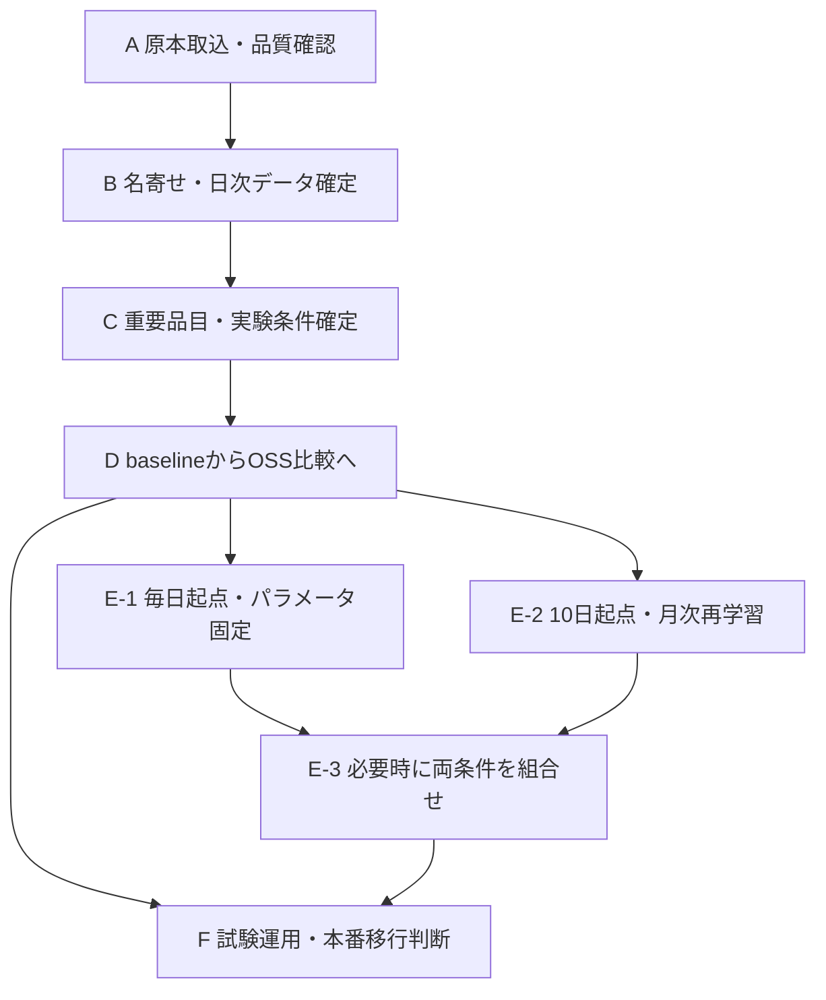

# ブンセン株式会社 重要品目選定・予測OSS比較基盤 実装仕様書

| 文書管理 | 内容 |
|---|---|
| 文書番号 | BUNSEN-FCST-IMPL-002 |
| 版 | v2.2 完全版 |
| 作成日 | 2026年9月5日 |
| 用途 | 開発者・Codexへの実装指示、ブンセン様との仕様確認 |
| 対象 | 過去出荷データの取込、JAN名寄せ、重要品目選定、予測方式比較、試験運用への引継ぎ |
| 位置づけ | 本対象範囲ではv2.0本文、v2.1改訂指示書r2、旧付録Dの矛盾する記載を本書で置き換える |
| 基本情報 | 加須・神戸を含む過去3年分、約3,869ファイル。営業日は原則全暦日 |

本書は単独で機能・評価条件・受入基準を理解できる完全仕様である。旧版との読み合わせを実装の前提としない。付録Dの既存コードは再利用するが、本書への適合修正が必要である。本書の発行は実装完了や本番導入承認を意味しない。費用・日程・契約上の責任範囲は別途管理する。

## 1. 目的と完成条件

出荷数量の予測精度を高め、将来の在庫適正化、失注・倉庫間移送・廃棄の削減につなげる。初期目的は、同じ入力・評価対象・計算条件で複数の予測OSSを切り替え、実績との差と処理費用を比較できる基盤を作ることである。

初期完成条件は、原本CSVの取込から、重要品目の確定、前2年での学習、3年目の逐次予測、単日・累計の精度比較、CSV出力までが一連の操作で実行・再現できることとする。

出荷実績は潜在需要そのものではない。欠品による販売機会損失や廃棄削減額は本検証だけでは算出しない。精度の数値目標は事前に保証せず、baselineとの比較結果と業務条件をもとに採用を判断する。

## 2. 実装範囲

| 区分 | 内容 |
|---|---|
| 初期必須 | 一括取込、原本保存、重複・訂正管理、品質レポート、名寄せ候補・承認、日次集計、重要品目選定、baseline、実験管理、評価、画面、CSV出力 |
| OSS比較完了までに必須 | 統計・機械学習・時系列基盤モデルの3系統を目標に追加し、利用可否・不適合理由も記録する |
| 追加検証 | 毎日起点、月次再学習、実際の未来を予測する試験運用 |
| 後続開発 | 在庫配置最適化、製造計画、ボール換算、自動発注、担当者による計画修正・承認、本番システムへの書戻し |

OSS候補はStatsForecast、MLForecast、TimesFMとする。現在はStatsForecast AutoETS、MLForecast Ridge、TimesFM 2.5を固定条件のProviderとして実装済みである。TimesFMは専用CPU Workerで運用計測し、APIからPyTorchと重みを分離する。これは特定モデルの実データ適合・性能を保証するものではない。モデル・重み・依存ライブラリの版を固定して試験する。候補の適合性に問題があれば理由を示し、交換可能な構造のまま代替候補を検討する。

## 3. 構成と責務

初期構成はPythonの共通ドメイン処理、FastAPI、PostgreSQL、Parquet、簡易Web管理画面、バックグラウンドworkerとする。新規画面の既定はReact/TypeScriptとし、既存リポジトリがある場合は保守可能な既存構成を優先する。Docker Composeで開発環境を再現する。クラウド運用・CPU優先とし、GPUは必要な比較runだけに割り当てる。

| モジュール | 責務 |
|---|---|
| ingestion | ファイル保存・台帳・形式変換・重複/訂正検出 |
| master | 商品、JAN履歴、センター別取扱期間、承認 |
| dataset | 日次集計、欠損区分、時点別実績、スナップショット |
| selection | 重要品目候補・確定版管理 |
| backtest | 起点生成、学習、履歴更新、ジョブ・再試行 |
| forecast_provider | OSS差異を吸収するアダプター |
| evaluation | 評価予定表、共通対象、精度・失敗・費用集計 |
| reporting | 比較画面、グラフ、CSVと採用記録 |

HTTP処理の中で長時間学習を行わない。ジョブはDBで状態と実行権を管理し、workerが処理する。実データはアクセス制限した原本領域へ保存し、Gitにコミットしない。コード・仕様・匿名化した小規模テストデータをGitで管理する。

### 3.1 フェーズ図



日程は本書に含めない。最初は3〜5品目を目安に縦通しで処理を確認し、次に20〜50品目へ拡大する。

## 4. 原本取込と品質管理

### 4.1 入力と台帳

フォルダ指定またはZIP一括アップロードに対応する。ZIPの展開先逸脱、異常な展開容量、同名衝突を検出する。CSV原本は変更せずSHA-256を付ける。ファイルごとに原名、相対パス、容量、ハッシュ、センター、対象期間、取込時刻、文字コード、列定義版、処理状態、総行数・採用行数・隔離行数、エラーを記録する。

UTF-8/BOM付きUTF-8/CP932を候補として厳密デコードする。置換文字で読めたことにしない。ヘッダー別名・日付形式・数量列・センター識別ルールを列マッピング設定へ保存する。サンプルで未確認の列名は推測で固定しない。不明な形式は隔離し、他の正常ファイルの取込は続ける。

正規化した出荷行の必須情報は、原本ID・行番号、センター、出荷基準日、原JAN、原商品名、数量、単位、行区分、利用可能時刻、訂正関係とする。JANは文字列として先頭0を保持する。不正JANも原値を保存し、勝手に補正しない。

### 4.2 重複・訂正・数量

- 同一ハッシュの再取込は二重集計せず、取込要求履歴だけを残す。
- 内容が異なる同一論理ファイルは訂正版候補とし、最新版の決定理由を保存する。
- 全件再出力か差分出力かをファイル種別ごとに定義する。全件版の旧版と新版を合算しない。
- 同日・同商品でも正当な複数出荷があるため、JAN・日付・数量の一致だけで行を削除しない。伝票/明細キーがあれば利用する。
- 初期の予測単位はパックとする。単位不一致・不明単位は対象データセットの確定を止める。ボールへ換算しない。
- 負数量を自動で0にしない。取消は元出荷との対応で有効行を決め、返品は原則として別集計し、初期の非負出荷数量から除く。元データの意味が未確定なら対象を隔離する。
- 取込前後の数量照合を行い、除外・訂正・返品による差分を説明できるようにする。

### 4.3 品質レポート

センター×月のファイル数・数量、曜日別到着状況、連続未到着期間、文字コード・列形式の種類、エラー行、重複、訂正、単位不一致、不明JAN、負数量、名寄せ未決、日次欠損、データ期間を表示する。全3年分の取込件数と約3,869ファイルとの差がある場合は理由を記録する。3,869を固定上限にしない。

## 5. JAN名寄せと取扱期間

商品を表す不変IDとしてcanonical_product_idを採用し、JANの変更後も同一商品として承認された範囲だけ履歴を接続する。

### 5.1 候補抽出と承認

比較用商品名はUnicode正規化、全半角・空白の統一等を行う。原名は残す。内容量や規格を示す数字を削除しない。同名でJANが異なる組合せ、名称類似、旧JAN終了と新JAN開始の接近を候補として表示する。

候補には旧新JAN、商品名、規格、内容量、入数、単位、最初/最後の出荷日、併存期間、センター別数量推移、候補理由を表示する。商品名一致だけでは自動統合しない。

判定はSAME_PRODUCT（単純JAN変更）、DIFFERENT_PRODUCT、SUCCESSOR（規格変更等の後継品）、UNRESOLVEDとする。SUCCESSORは関連付けるが数量系列を単純結合しない。規格不明の場合は承認待ちとする。承認者・日時・理由・mapping_versionを保存する。

### 5.2 有効期間

JAN対応表にはvalid_from/valid_toを保持し、同じJAN・同じ日付に複数の商品が対応しないよう検査する。期間は開始日・終了日とも含む。終了未定はNULLとする。旧新JANの併存は認め、両方の正当な出荷行を同一商品へ集計する。

商品×センターの取扱期間を別管理する。発売前、未導入センター、終売後はNOT_HANDLEDとし、需要0として補完・学習しない。初回/最終出荷日は取扱期間の候補であり確定日と断定しない。開始日は確認値を優先し、不明時は初回出荷日を暫定開始として根拠を記録する。最終出荷だけで終売を推定しない。

主比較はTRAIN内に必要な履歴を持つ固定系列集合とする。TESTで新規取扱となる系列は新商品評価として別表示する。TEST情報を用いた名寄せ・選定は事後整理であることをスナップショットへ記録し、厳密な当時再現と区別する。

## 6. 日次集計、稼働日、欠損

### 6.1 基本日付

全暦日を稼働日とする。通常年365日、うるう年366日とし、曜日・祝日・年末年始を一律に除外しない。業務日付のタイムゾーンはAsia/Tokyo、時刻の保存はUTCとする。日次粒度はcanonical_product_id×center_id×ds（出荷基準日）とする。

### 6.2 完全性と0補完

予定ファイル定義はセンター・ファイル種別・有効期間・対象日との対応で管理する。1ファイルが複数日を覆う場合も対象範囲を明示する。件数一致だけでなく、必要な論理ファイルが全部そろい、形式・範囲・取込が正常であることを完全性条件とする。

| 日次状態 | y | 学習・評価の扱い |
|---|---|---|
| OBSERVED | 非負実績 | 対象 |
| CONFIRMED_ZERO | 0 | 取扱期間内、予定1件以上、完全取込済み、商品行なしの場合のみ |
| MISSING | NULL/NaN | 自動0補完しない。実績評価の対象外として件数表示 |
| NOT_HANDLED | NULL | 取扱期間外。学習・評価対象外 |
| CLOSED | 0 | 確認済み休業。初期の通常稼働精度から除外し件数表示 |
| PARTIAL_OR_INVALID | NULL | 不完全な実績を確定値にしない |

予定0件を「全件取込済み」と判断しない。確認済み休業日の0は営業日の自動補完とは別の規則である。休業日に実出荷があれば矛盾として確認し、実績を消さない。学習の日付を圧縮せず、欠損・休業フラグを保持する。休業値を学習から除くかは前処理設定で固定する。

欠損対応が必要なOSSは過去方向だけの補完または系列単位の非対応を宣言する。補完方法は記録し、将来実績を使う補間は禁止する。補完した実績を正解値として評価しない。例外未申告を理由に取込全体を停止せず、全暦日稼働という前提と未解決事項を保存する。

## 7. 利用可能時点と未来情報防止

origin_dateは「予測対象初日の前日」を示す日付とする。cutoff_atは当該予測で情報を参照できる締切時刻で、初期既定はorigin_date翌日の00:00 JSTとする。この時刻は検証上の仮定であり、実運用時刻と判明した確定遅延に合わせ変更する。

入力条件はds <= origin_dateかつavailable_at <= cutoff_atである。TRAINの最終学習も同じ利用可能条件に従う。締切に間に合わない最新日はNaNとして保持し、日付だけを根拠に投入しない。

過去の確定時刻が不明な場合はavailability_mode=ASSUMEDとし、初期仮定としてavailable_at=ds翌日00:00 JSTを生成する。実測時刻がある場合はOBSERVEDを使用する。両条件を同一評価として混ぜない。仮定による結果には「当時のデータ到着を厳密再現したものではない」と明示する。

訂正値は同一業務キーに対する版として保存し、起点時点で利用可能な版だけを履歴入力へ使う。評価の正解は固定したtruth_versionとする。当時版がなく最終訂正値しかない場合は制約を記録する。

曜日等の既知将来特徴量は利用可。販促、休業予定等は当時公表済みの版だけ利用可。全期間での正規化・外れ値閾値学習・特徴選択・ハイパーパラメータ調整は禁止する。学習が必要な前処理はTRAIN内に限定し、版と学習範囲を保存する。

## 8. 重要品目と実験条件の確定

全3年を取り込んだ上で、数量、数量構成比、変動係数、出荷0の比率、欠損率、JAN変更有無、業務指定を確認して20〜50品目を選ぶ。初期の3〜5品目には、安定品・間欠品・JAN変更品を可能な範囲で含める。2センターなら最大100系列が目安となる。

選定画面には品目ごとの選定理由と対象センターを表示し、selection_versionで凍結する。欠損を0とみなして変動係数や出荷0率を計算しない。

全3年の情報による品目選定は探索的比較として許容する。選定を予測結果の確認後に変更する場合は新selection_versionと新experiment_idを発行し、元結果も残す。絶対精度をそのまま本番KPIにしない。

実験確定時に、データ・正解・名寄せ・取扱期間・選定・前処理・カレンダー・評価ポリシー・利用可能時点・予算・OSS設定を凍結する。パラメータ調整はTRAIN内の時系列分割で実施し、採用設定でTRAIN全体を最終学習する。ランダム分割は禁止する。調整中の学習回数と、最終モデルの学習回数を別記する。

## 9. 予測方式

### 9.1 期間と起点

TRAINは前2年、TESTは続く1年とする。開始/終了日は実データ範囲から明示的に確定し、年数を730/365日に固定換算しない。TRAIN終了日+1日=TEST開始日を必須とする。

```text
N = (test_end - test_start).days + 1
origin(k) = train_end + k * origin_interval_days
k = 0,1,... かつ origin(k) < test_end
target = origin + h日
h = 1,...,max_horizon
保存対象 = test_start <= target <= test_end
```

初期は起点間隔10日、最大15日先、最終パラメータ学習はrun単位で1回。TEST期間の実績は履歴・状態更新にだけ使い、パラメータ再推定には使わない。ゼロショットモデルは学習不要でよいが初期化・重み版を記録する。

### 9.2 検証条件

| 段階 | 起点間隔 | 学習条件 | 区分 |
|---|---|---|---|
| D | 10日 | TRAIN最終学習1回、固定 | 初期正式比較 |
| E-1 | 1日 | TRAIN最終学習1回、固定 | 毎日更新条件の比較 |
| E-2 | 10日 | 月次再学習 | 再学習参考比較 |
| E-3 | 1日 | 月次再学習 | 組合せ参考比較 |

月次再学習は各月最初の予定起点で実行し、初回起点では初期学習済みモデルを使う。学習窓は初期既定で拡大型とし、その起点までの利用可能な実績を使用する。月による実際の回数を記録し「必ず12回」と固定しない。

段階間の直接比較ではDの起点集合を共通起点として抽出する。各段階の全起点を使った運用別スコアは別表示とする。

### 9.3 事前検証

起点間隔・最大horizon・primary_horizon_maxはboolを除く1以上の整数。上限は実装既定400日。report_horizonsと累計窓は重複のない正整数で最大horizon以下とする。日付順序、連続境界、空系列、重複ID、未確定設定、非対応モデル、メモリ/時間上限未設定を検査する。0間隔・負間隔は起点生成前に拒否する。

### 9.4 規模の検算

| TEST日数 | 起点間隔 | 起点数 | 1系列の点予測行数 | 通期の予定対象日数 |
|---|---|---|---|---|
| 365 | 10 | 37 | 545 | 365 |
| 366 | 10 | 37 | 546 | 366 |
| 365 | 1 | 365 | 5,370 | 365 |

行数はΣ min(15, N-k×間隔)で算出する。365日・100系列・4runでは点予測218,000行。区間出力を保存する場合は分位数の数だけ増える。これは完全出力時の予定数であり、性能・処理時間を保証するものではない。

## 10. ForecastProvider共通契約

### 10.1 インターフェース

```python
class ForecastProvider(Protocol):
    def metadata(self) -> ProviderMetadata: ...
    def validate(self, dataset: ForecastDataset, config: ProviderConfig) -> ValidationResult: ...
    def fit_parameters(
        self, train_df: DataFrame, config: ProviderConfig, context: RunContext
    ) -> ModelRef: ...
    def refresh_context(
        self, model_ref: ModelRef, history_df: DataFrame, origin_date: date, context: RunContext
    ) -> ContextRef: ...
    def predict(
        self,
        model_ref: ModelRef,
        context_ref: ContextRef,
        future_df: DataFrame,
        horizons: list[int],
        context: RunContext,
    ) -> DataFrame: ...
    def cleanup(self, context: RunContext) -> None: ...
```

この6メソッドを維持する。horizonsを1回でまとめて指定する。整数horizonを最大予測長として使うAPIも存在するため、単数引数だから15回呼出が必要という一般化はしない。内部OSS APIへの変換はアダプターの責務とする。

| 型 | 必須内容 |
|---|---|
| ForecastDataset | snapshot/selection、対象ID、TRAIN/TEST、起点間隔、最大horizon、評価窓、既知将来列 |
| ProviderConfig | provider/model識別、params、interval_levels、前処理版 |
| RunContext | run/experiment ID、seed、締切・入出力領域、resource profile、logger、cutoff_at、availability_mode、失敗記録先 |
| ModelRef | model/provider/version、学習範囲、学習時刻、成果物URI、重みと前処理の識別、パラメータ指紋 |
| ContextRef | context/model ID、origin_date、history_end、cutoff_at、履歴状態 |
| ValidationResult | code/message/blockingの配列 |

旧付録DにないRunContext等の項目はv2.2として追加する。各起点に個別RunContextを渡す。モデル・履歴を別runへ暗黙共有しない。引数DataFrameを破壊的に変更しない。

### 10.2 入出力

学習・履歴はunique_id（文字列）、ds（日単位日時）、y（数値、欠損はNaN）を基本とする。日付とIDのNULL、無限大、重複キー、未処理の負実績を拒否する。available_at等は共通の時点フィルターで検査後、モデル入力から分離する。呼出側とprovider側の双方で日付上限を確認する。

future_dfはunique_id、origin_date、target_date、horizonおよび許可した既知将来列だけとする。実績y、将来観測特徴量、予測対象外キーを拒否する。

出力はunique_id、origin_date、target_date、horizon、forecast_kind、quantile、yhat_raw、yhatとする。forecast_kind=POINTのquantileはNULL、QUANTILEは0<quantile<1とする。旧版の「0.5を点予測の識別に使う」方式は廃止し、中央値と点予測を別保存できるようにする。旧baselineの0.5行はPOINTへ移行する。

yhat_rawはOSS出力、yhat=max(0,yhat_raw)。両方を保存し、全OSS共通でyhatを点予測評価に使う。予測値のNaN・±Infは拒否する。DB丸め前に同じ規則を適用し、小数6桁で保存する。業務用整数化は比較後の別処理とする。

共通validatorはdtype、日付差=horizon、horizon範囲、起点一致、要求キー外・重複、要求分位数ごとの不足、POINT不足、分位数順序を検査する。全結果が空の場合も「検証成功」とせず予定表に全件失敗を残す。

### 10.3 能力と適合試験

provider/model/ライブラリ版/重み版/実行環境ごとに、パネル、外生変数、区間、context refresh、parameter refit要否、GPU要否、モデル別最小履歴、対応horizon、ライセンス、オフライン可否、外部送信先を記録する。全モデルの最大必要履歴を共通の除外条件にしない。

適合試験では固定パラメータの不変性、履歴反映、未来情報非参照、出力完全性、再現性、失敗通知を確認する。model_idが同じというだけでパラメータ不変と判定せず、状態更新可能部分と学習パラメータを分けて指紋を比較する。

固定条件に合格した構成だけを固定条件ランキングへ掲載する。再学習要件だけが不適合なら参考runへ分離する。未来情報混入・不正出力の不適合は参考ランキングでも許容しない。ライブラリ・アダプター・重み・主要実行条件が変わった場合は再試験する。

## 11. baseline仕様

| モデル | 点予測規則 | 必要履歴の既定 |
|---|---|---|
| seasonal_naive_7 | 対象日と同曜日で起点以前の最新候補を使う。欠損なら同曜日4候補までさかのぼる | 有効観測7日 |
| moving_average_28 | 起点日を末尾とする28暦日内の非欠損値の平均 | TRAIN有効観測28日 |
| same_weekday_mean_4 | 起点以前の同曜日4候補の非欠損平均 | TRAIN有効観測28日 |
| seasonal_naive_364 | 対象日の364日×ceil(h/364)日前。欠損時は予測不能 | TRAIN有効観測364日 |

同曜日候補の日付はtarget_date-7×j、j=ceil(h/7)から連続4整数とする。10日先・15日先で起点後の「前週実績」を参照しない。移動平均は履歴の最終観測日を起点と取り違えず、origin_dateまで再インデックスする。全候補欠損なら失敗とする。使用観測数と欠損時の代替利用を記録する。

初期は点予測必須、予測区間は任意とする。区間を出す場合、TRAIN内で本予測と同じ欠損規則・同じ時点制約により残差を作る。残差計算は起点ごとに反復せず最終学習時にキャッシュする。残差不足は区間未提供とし、幅0を高信頼区間として表示しない。POINTと中央値の順序は仮定せず、QUANTILE同士だけ順序を検査する。

## 12. 評価対象と公平性

### 12.1 評価予定表

予測実行前に、商品×センター×origin×target×horizonの予定表を作る。取扱期間・確認済み休業・正解欠損等による対象外はOSS共通で固定し、理由を保存する。予測成功の有無を評価対象の決定に使わない。

各runの各予定キーはPENDING、SUCCESS、FAILED、UNSUPPORTED、CANCELLEDのいずれかへ遷移させる。POINT不在は成功扱いにしない。区間の成功率はPOINTと別管理する。実績欠損はモデル失敗ではない。

正式なスコアは全予定キーの状態確定後に作成する。実行中は暫定表示とする。モデル例外を0予測に変換しない。

### 12.2 ランキング

| 表示 | 定義 |
|---|---|
| 完全出力ランキング | 同一評価条件で全評価対象のPOINTが成功し、適合済みのrunだけ。通期micro WAPE昇順 |
| 共通成功対象比較 | 指定した比較runすべてが成功したキー集合で比較。対象数・数量被覆率を必ず表示し、完全出力ランキングと区別 |
| run単独スコア | そのrunの成功分だけの参考値。異なる母集団で順位付けしない |
| フォールバック込み | 事前指定baselineで失敗を補う別評価。元runの失敗と補完元を保持 |

共通成功集合は比較runを変更すると変わるためcomparison_set_idとキー集合ハッシュを保存する。共通集合が空なら精度を算出しない。全runが不完全でも無理に正式1位を決めず、不完全な原因を提示する。

成功率=成功POINTキー数/予測予定キー数。完全成功系列率=全予定POINTがそろった系列数/対象系列数も表示する。正解が存在する評価対象の被覆率を別表示し、予測可能性と評価可能性を混同しない。

### 12.3 評価単位

1. 通期運用評価：各targetに対し予定起点のうち最新を事前選択し、その予測を1件評価する。予測失敗時に古い起点へ勝手に置換しない。最大horizonとprimary_horizon_maxが起点間隔以上なら原則全日を覆える。毎日起点ではh=1、10日起点ではh=1〜10が選ばれる。実際の被覆と不足を検算する。
2. horizon別：h=7,10,15の単日を別々に評価する。段階間の直接比較は共通起点・共通target・同一hで行う。
3. 累計：各originからh=1〜10、1〜15のPOINTと実績をそれぞれ合計して評価する。全日がTEST内・評価対象で、必要予測と実績が全部ある窓だけ算出する。窓が欠けた理由と完全窓率を表示する。期間末の不完全窓を短縮して10/15日と呼ばない。

15日累計窓は10日間隔では重複する。窓単位の精度として扱い、Under/Overを年間の実不足・実余剰量として合計解釈しない。初期の累計はPOINTだけとし、日別分位数の単純合計を累計の予測区間としない。

### 12.4 指標

評価集合Sの実績y、補正後点予測p、誤差e=p-yとする。

| 指標 | 計算 |
|---|---|
| micro WAPE | 100×Σabs(e)/Σy |
| MAE | Σabs(e)/件数 |
| RMSE | sqrt(Σe²/件数) |
| Bias quantity | Σe |
| Bias rate | 100×Σe/Σy |
| Under quantity | Σmax(y-p,0) |
| Over quantity | Σmax(p-y,0) |
| baseline改善率 | 100×(WAPE_baseline-WAPE_model)/WAPE_baseline |

Σy=0ならWAPE/Bias rateはNULL。件数0なら全指標NULL。baseline WAPE=0なら改善率NULLとし誤差の絶対差を併記する。実績0の個別行は除外しない。商品別macro WAPEはNULLを除き、算出商品数/全対象商品数を表示する。累計指標は日次ではなく窓の合計値へ同式を適用する。

全体、商品、センター、対象月、起点月×horizon、安定品/間欠品/JAN変更品/新商品で集計する。グラフには実績欠損を切れ目として表示し、0に見せない。区間を提供するrunは被覆率・平均幅を別表示し、点予測順位と混ぜない。

## 13. データモデルと保存規則

IDはUUIDを基本とする。仕様の版IDは文字列可。以下の業務キーにDB一意制約を実装し、参照関係を外部キーで担保する。JSONだけへ全業務データを詰め込まない。

| テーブル | 主な列・制約 |
|---|---|
| source_files | id、hash UNIQUE、URI、原名、台帳情報、状態 |
| shipment_rows | id、source_file_id、row_number、正規化列、訂正キー。原本ID+行番号 UNIQUE |
| file_expectations | center/type、有効期間、対象範囲、予定論理キー、版 |
| products | canonical_product_id、商品名、規格、単位 |
| jan_mappings | JAN、有効期間、canonical_product_id、mapping_version、承認情報。同一版で対応期間の競合禁止 |
| product_center_periods | 商品、center、開始/終了、確定/仮定、版 |
| calendar_exceptions | center、ds、区分、理由、available_at、承認、版 |
| daily_observation_versions | 商品、center、ds、available_at、y、状態、原本参照、revision。業務キー+revision UNIQUE |
| dataset_snapshots | id、manifest、各マスター版、truth_version、前処理・availability、content_hash、確定日時 |
| selections / selection_items | selection_version、対象商品・センター、理由、承認、選定に使った期間 |
| experiments | id、snapshot/selection、条件JSON、evaluation_policy_version、凍結日時 |
| forecast_runs | run_id、experiment_id、provider/model/重み/環境版、設定、seed、学習条件、状態、試験参照、費用 |
| forecast_origins | run_id+origin_date UNIQUE、cutoff、model/context参照、状態、attempt、時間 |
| forecast_expectations | run_id+unique_id+origin+target UNIQUE、horizon、評価可否、除外理由、POINT状態、失敗理由 |
| forecast_values | 下記DDL |
| evaluation_results | run、comparison_set_id、scope、集約軸、policy/truth版、件数、分母、metrics |
| provider_conformance_tests | id、provider/model/環境の完全識別、実施者・日時、項目別結果、掲載可否 |
| adoption_decisions | 採用版、対象、採用run、理由、比較集合、決定者、変更履歴 |
| audit_logs | 操作者、日時、操作、対象、変更前後、理由 |

### 13.1 予測値DDL

以下はforecast_runs作成後に適用するPostgreSQL用DDLである。全体マイグレーションは上表を含めて実装する。

```sql
CREATE TABLE forecast_values (
    id UUID PRIMARY KEY,
    run_id UUID NOT NULL REFERENCES forecast_runs(run_id),
    unique_id TEXT NOT NULL,
    origin_date DATE NOT NULL,
    target_date DATE NOT NULL,
    horizon SMALLINT NOT NULL,
    forecast_kind TEXT NOT NULL CHECK (forecast_kind IN ('POINT','QUANTILE')),
    quantile NUMERIC(8,6),
    yhat_raw NUMERIC(20,6) NOT NULL,
    yhat NUMERIC(20,6) NOT NULL,
    created_at TIMESTAMPTZ NOT NULL DEFAULT now(),
    CHECK (target_date > origin_date),
    CHECK (horizon = target_date - origin_date),
    CHECK (horizon BETWEEN 1 AND 400),
    CHECK ((forecast_kind='POINT' AND quantile IS NULL)
        OR (forecast_kind='QUANTILE' AND quantile IS NOT NULL
            AND quantile > 0 AND quantile < 1)),
    CHECK (yhat_raw <> 'NaN'::numeric AND yhat <> 'NaN'::numeric),
    CHECK (yhat = GREATEST(yhat_raw, 0))
);
CREATE UNIQUE INDEX uq_forecast_point ON forecast_values
    (run_id, unique_id, origin_date, target_date) WHERE forecast_kind='POINT';
CREATE UNIQUE INDEX uq_forecast_quantile ON forecast_values
    (run_id, unique_id, origin_date, target_date, quantile) WHERE forecast_kind='QUANTILE';
CREATE INDEX ix_forecast_horizon ON forecast_values(run_id,horizon);
CREATE INDEX ix_forecast_target ON forecast_values(run_id,target_date);
```

評価の役割はforecast_valuesに保存しない。同じ予測が通期とhorizon別と累計に使われるため、評価処理が予定表から導出する。POINT/QUANTILEの分離はv2.2での意図的な契約変更として旧出力変換と移行試験を追加する。

スナップショットは原本・採用訂正版・マスター・前処理・評価正解の参照とハッシュを固定する。変更は新snapshotとして作る。モデル成果物、予測値、評価対象集合、設定、実行ログをrunから追跡できるようにする。

## 14. ジョブ、失敗、再現性

run状態はQUEUED→RUNNING→SUCCEEDED/PARTIAL/FAILED/CANCELLEDとする。SUCCEEDEDは必要POINTすべて成功、PARTIALは一部失敗。出力0件を成功としない。適合可否とジョブ成功は別属性とする。

ネットワーク等の一時障害のみ既定2回まで再試行する。不正入力・契約違反は自動再試行しない。起点単位にトランザクションで予測値と状態を保存し、再開時に二重登録しない。完了済みrunの条件や結果は上書きせず、新runにする。失敗attemptの部分出力を成功結果に混ぜない。

初期既定の起点時間上限は600秒、run全体は7,200秒とし、実測後に設定変更可とする。workerのCPU・メモリ上限をresource profileで指定し、OOM・timeoutを記録する。停止操作で次起点を開始せず、強制停止時も状態を回収する。

学習時間、推論時間、前処理時間、最大メモリ、CPU/GPU経過時間、モデル取得時間、保存容量を分離して記録する。費用は計測量×登録単価で算出し、単価と取得日を保存する。単価不明はNULLとし0円にしない。モデルダウンロード費用と定常推論費用を分離する。

依存はlockファイル、Python版、コンテナdigest、モデル重みchecksumで固定する。再現性試験は同一入力反復のばらつきも確認する。決定論的baselineは完全一致必須。非決定論的処理の許容誤差はTESTを見る前に試験設定へ明記し、未来情報改変時の差を単に乱数のせいとして合格にしない。

## 15. 画面とAPI

| 画面 | 必須操作・表示 |
|---|---|
| 取込 | アップロード/フォルダ取込、進捗、正常/隔離/重複/訂正、再処理 |
| 品質 | センター・期間別集計、欠損と0の区別、元行参照、確認事項 |
| 名寄せ | 候補比較、規格・併存確認、承認/別商品/後継/保留、履歴 |
| 重要品目 | 候補の数量・変動・欠損、選定理由、センター、確定操作 |
| 実験 | 期間、利用時点、OSS/モデル、条件、予算、凍結、実行/停止/再開 |
| 比較 | 同条件ランキング、共通対象・被覆率、単日/累計、失敗、費用、月別グラフ |
| 採用 | 比較結果、採用理由、決定者、対象、フォールバック、版管理 |

主要APIは次を実装する。APIは同じ認証・権限検査を適用し、画面だけで制限しない。

| メソッド・パス | 内容 |
|---|---|
| POST /api/imports | 取込ジョブ作成。202とjob_id |
| GET /api/imports/{id} | 状態・件数・エラー |
| GET /api/quality | snapshot/center/期間で取得 |
| GET /api/matching/candidates | 名寄せ候補 |
| POST /api/matching/{id}/decision | 判定、理由、expected_version |
| POST /api/datasets/freeze | 検証してsnapshot確定 |
| POST /api/selections | 対象と理由を保存 |
| POST /api/selections/{id}/freeze | 選定確定 |
| GET /api/providers | モデル別能力・適合状態 |
| POST /api/experiments | 固定条件の実験作成 |
| POST /api/experiments/{id}/runs | run作成。202とrun_id |
| GET /api/runs/{id} | 状態・起点進捗・失敗・資源 |
| POST /api/runs/{id}/cancel | 中止要求 |
| POST /api/runs/{id}/resume | 同条件の中断runだけ再開 |
| GET /api/comparisons | run_ids、scope、集約軸で比較 |
| GET /api/exports/{id} | 許可された出力の取得 |
| POST /api/adoptions | 採用記録 |

作成操作にIdempotency-Keyを受け付け、同一要求の二重実行を防ぐ。承認・凍結は楽観ロックを使い競合時409、設定違反422、権限不足403とする。エラー応答はcode/message/details/request_idとする。

CSVはUTF-8 BOM付き、日付ISO形式、JAN文字列を保つ。表計算で数式扱いされる名称等の文字列は安全にエスケープする。出力にはexperiment/run/snapshot/selection/policy版、条件、評価対象数、除外理由、指標の単位を含める。

## 16. 権限、運用、本番への引継ぎ

閲覧者は比較・出力、分析担当は取込・実験、業務承認者は名寄せ・選定・採用、管理者は権限・実行資源設定を扱う。兼務を許容するが操作者と判断理由を残す。クラウドは認証必須、TLS、秘密情報は環境設定/secret管理とし、ソースへ埋め込まない。

原本・DB・成果物のバックアップを行い、復元試験を実施する。初期運用目標はRPO24時間/RTO1営業日として検証環境で確認し、本番移行時に見直す。ログ・成果物の保持期間は設定化し、初期は比較完了前の自動削除を無効とする。

本番流用するのは取込、マスター、snapshot、provider、評価、監査の共通処理。バックテストと本番で同じ前処理・予測コードを使い、本番では入力期間・起点生成を差し替える。製造や発注への自動書戻しは本範囲に含めない。

試験運用は採用候補・前処理・指標を固定し、実際に未来予測を保存してから実績と比較する。初期提案は連続30暦日以上とし、季節性の検証が十分とはみなさない。試験中の変更は新しい採用版で追跡する。過去3年での選定結果と未来の試験結果を分けて報告する。

## 17. 受入基準

19件の旧テスト成功だけでは本書の受入完了としない。各項目の実行コマンド、環境、入力、期待値、結果、証跡を保存する。

| ID | 試験・合格条件 |
|---|---|
| AC-01 | 同一CSVを2回投入して日次数量が増えない。訂正版を旧版と合算しない |
| AC-02 | UTF-8/CP932・不正形式・不明単位を判別し、原本へ追跡可能 |
| AC-03 | 同名JAN変更は承認で接続、規格違いは勝手に統合しない |
| AC-04 | 発売前・未取扱・終売後を0補完しない。取扱期間不明の根拠を記録 |
| AC-05 | 完全取込の未出荷は0、未到着/予定0件/部分データは欠損。休業と矛盾する出荷を検出 |
| AC-06 | 365日と366日の起点・行数が9.4と一致。0/負間隔、日付逆転、horizon不正を事前拒否 |
| AC-07 | 将来実績・締切後の訂正版だけを改変して同一起点の予測が変わらない。前処理を含む実行経路で検証 |
| AC-08 | 同一パラメータで利用可能な履歴だけを変え、変化すべき人工データで予測変化を確認。パラメータ指紋は不変 |
| AC-09 | POINT/分位数/商品/日付の不足、重複、余分、NaN/Inf、不正型を検出し成功扱いにしない |
| AC-10 | baseline4種が定義どおり動き、本予測と残差計算の欠損規則が一致。起点末尾欠損で窓がずれない |
| AC-11 | 意図的な予測失敗が評価予定表に残り、成功率低下・正式順位対象外になる |
| AC-12 | 10日/15日累計の手計算例に一致。不完全窓・実績欠損窓を短縮集計しない |
| AC-13 | y=[0,10],p=[5,5]でWAPE=100%、MAE=5、RMSE=5、Bias=0、Under=5、Over=5。全実績0はWAPE NULL |
| AC-14 | 共通成功対象と各run単独対象を区別し、比較集合変更で集合IDも変わる |
| AC-15 | 段階D/E直接比較が同一商品・起点・target・horizonに限定され、運用別通期と混ざらない |
| AC-16 | timeout・キャンセル・再開で二重出力がなく、部分結果と費用が追跡可能 |
| AC-17 | 別OSS追加が共通取込・評価・画面の個別分岐追加なしで可能 |
| AC-18 | 画面/APIの権限、承認競合、実データの公開禁止、バックアップ復元を確認 |
| AC-19 | 同じsnapshot/config/環境で再現できる。非決定論的構成は事前許容値と反復結果を提示 |
| AC-20 | 少数の実品目で取込→名寄せ→選定→予測→評価→CSVを完走し、元数量と照合 |
| AC-21 | 20〜50品目でOSS比較を実施し、モデル別適合証跡・失敗率・精度・時間・費用・制約を提出 |

AC-01〜20を初期基盤の完成条件、AC-21をOSS比較段階の完成条件とする。実データが未提供の項目は未実施と明記し、人工データの成功で置き換えない。

## 18. 実装順序と納品物

| 順序 | 作業 | 完了判定 |
|---|---|---|
| 1 | 本書をリポジトリへ保存、既存付録Dと差分確認、依存固定 | 旧テスト再現とv2.2変更一覧 |
| 2 | 取込・日次・名寄せ・品質の最小実装 | 原本と日次数量の照合 |
| 3 | baseline改修・実験・予定表・評価 | AC-06〜16等の人工例に合格 |
| 4 | 最小画面と少数実品目の縦通し | AC-20 |
| 5 | 重要品目拡大、OSS候補を順次追加 | AC-21 |
| 6 | Eの追加検証と未来の試験運用 | 条件別結果と本番判断記録 |

納品は本仕様、ソース、DBマイグレーション、依存lock、Docker定義、設定例、README、AGENTS.md、実行手順、テスト証跡、品質レポート、名寄せ・選定版、予測/精度CSV、費用と制約一覧、運用/復元手順とする。実データはコード納品ZIPへ無断同梱しない。修正指示書だけを完全仕様の代わりに渡さない。

### 18.1 Codexへの実装ルール

リポジトリ直下のAGENTS.mdに以下を記載する。

```text
本プロジェクトはBUNSEN-FCST-IMPL-002 v2.2に従う。
初期の目的は出荷予測OSSを公平に比較できる基盤の構築。
まず既存コードと仕様を確認し、作業計画と検証方法を記録する。
承認済み範囲の実装・修正・検証は段階ごとに継続する。
旧付録Dは出発点であり、19件の成功だけで受入完了としない。
未来実績を前処理・学習・履歴・設定調整へ混入させない。
予測失敗を評価母集団から黙って除外しない。
欠損と出荷0、取扱期間外を区別する。
POINTとQUANTILEを区別する。
業務上の未確定事項を事実として作らず、仮定と対象範囲を記録する。
共通契約を変更する場合は版・移行・影響・テストを同じ変更に含める。
実データ・認証情報をGitへ保存しない。
変更ファイル、検証結果、未実施項目、残課題を各段階で報告する。
公開・本番反映・発注等は別途の指示対象とする。
```

テストコマンドは実際のリポジトリに合わせREADMEとAGENTS.mdへ明記する。開発に使用するAIモデル名を業務処理の依存にしない。GPT-6等を開発に使っても、出荷予測本体へのLLM API組込みは本書の必須要件ではない。

## 19. データ受領時の確認事項と暫定処理

以下は業務情報であり、未回答でも原本取込と人工データによる開発は進められる。影響する実データの確定・評価だけに制約を適用する。

| 確認事項 | 暫定処理・制約 |
|---|---|
| 全3年分の保存場所・期間・ファイル数 | 未提供分を未受領と表示。完全集計と称しない |
| 出荷基準日・数量列・単位 | 列マッピング確定まで該当形式を隔離 |
| 全件/差分/訂正の意味、伝票キー | 二重集計疑いを隔離し、原本は保持 |
| センター別予定ファイル種別・対象範囲 | 完全性不明の日を0補完しない |
| 返品/取消の表現 | 負数量の意味が解決するまで対象を確定しない |
| JAN変更理由、規格・入数 | 自動名寄せせず候補として提示 |
| 取扱開始/終了 | 初回出荷による暫定開始を明示。終了を推測しない |
| 確定時刻・遅延・訂正履歴 | ASSUMED条件で検証し制約を明示 |
| 例外休業日 | 基本全暦日稼働。既知例外のみ登録 |
| 重要品目と採用判断者 | 候補まで作成し、承認済みと称しない |
| 実行クラウド資源と単価 | ローカル試験は可能。費用不明をNULL表示 |

## 20. v2.1からの主要な変更

予測失敗を予定表で管理し公平な比較集合を定義した。単日評価に加えて10/15日累計を追加した。通期評価は起点間隔ごとの運用評価へ修正し、段階間は同一起点で比較する。取扱期間と規格を名寄せ・0補完の条件へ追加した。利用可能時点・訂正履歴・仮定を明記した。POINTと中央値を分離し、入力不正と出力不足の検査を強化した。旧baselineの欠損規則と残差計算を統一する要件を追加した。過去検証後の未来試験運用を定義した。

これらは本書で確定する実装要件であり、既存ZIPへ既に実装済みという意味ではない。

## 21. v2.9 Phase 2A 追加実装

時系列基盤モデルの比較候補としてTimesFM 2.5 200Mを追加する。使用可能な重みはApache-2.0の`google/timesfm-2.5-200m-pytorch`を固定revision、file size、SHA-256で検証したものに限る。TimesFM 3.0重みは非商用ライセンスのため本番候補へ含めない。

推論入力は起点以前を因果的に前方補完した最大512日、出力はhorizon 1〜400のPOINTとする。重み取得を推論経路から分離し、実行時ネットワーク接続を禁止する。重み、ローカルpath、PyTorch objectをartifactへ保存しない。PyTorchはAPIから分離した専用Workerだけへ導入する。Provider、checkpoint検証、runtime、artifact codec、executorを別moduleとし、既存のsnapshot、予定表、失敗台帳、比較契約を共用する。詳細は[Phase 2A TimesFM 2.5 Provider](Phase2A_TimesFM_2p5.md)を参照する。

## 22. v2.9 Phase 2B 追加実装

TimesFM専用Workerは、本番候補環境で予測runを始める前に固定checkpointとresource隔離を検査する。モデル初期化、warm-up、反復予測を分離し、wall time、CPU time、process peak RSS、実行環境、cgroup CPU・memory上限を機械可読な不変レポートへ保存する。

既定の`cpu-timesfm`はCPU 2、memory 4 GiB、人工3系列、context 512日、horizon 15、warm-up 1回、計測3回とする。初期化・予測の600秒上限と4 GiB peak RSS上限は技術ガードであり本番SLAではない。checkpoint path、重み、入力系列、予測値はレポートへ含めない。benchmark serviceはnetworkを無効化し、checkpointをread-only mountする。詳細は[Phase 2B TimesFM運用計測](Phase2B_TimesFM運用計測.md)を参照する。

## 23. v2.9 Phase 2C 追加実装

実業務原本を取込む前に、一回実行の`kiban-real-data-preflight`でPhase 1X〜1Kの実行境界を確認する。取込入力、原本archive、snapshot、受入report、プリフライトreportの5 rootは絶対pathで指定し、存在、directory、読取、symlink、相互重複、application root外、実効read/writeを検査する。inputだけをread-onlyとし、残る4 rootは一時probeを作成・削除できる必要がある。

PostgreSQLはmajor version 17、Phase 1X〜1Kの必須23 relation、実行roleのSELECT・INSERT・UPDATE権限を要求する。10項目すべてを満たす場合だけ`READY_FOR_DATA`とし、不足時は`BLOCKED`にする。format version、固定条件、pathを除いた真偽値・件数、判定、実行環境を内容アドレス方式JSONへ保存し、既存内容を上書きしない。DSN、database/user名、local path、directory entry、原本名を保存しない。詳細は[Phase 2C 実データ受入プリフライト](Phase2C_実データ受入プリフライト.md)を参照する。

`READY_FOR_DATA`は環境の投入準備だけを表し、実データ受入、数量照合、精度、業務判断、本番SLA、復旧訓練の完了を表さない。
