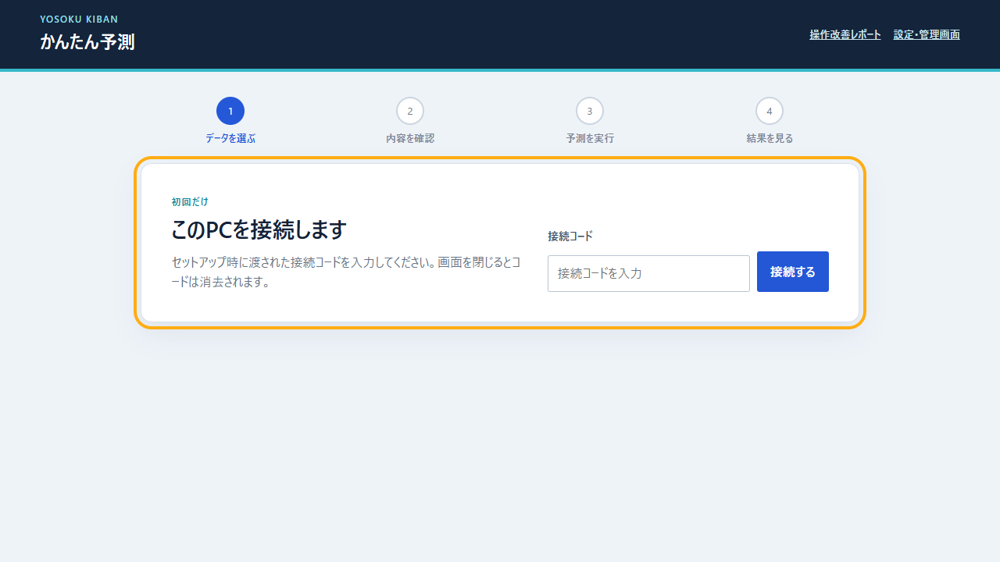
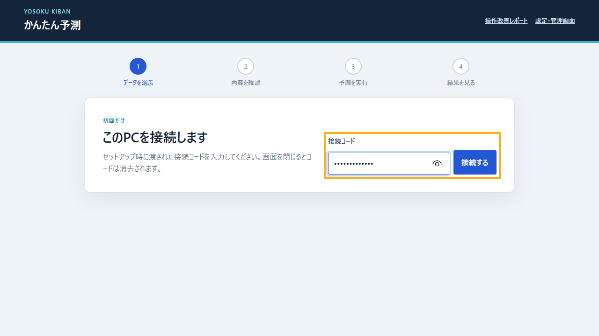
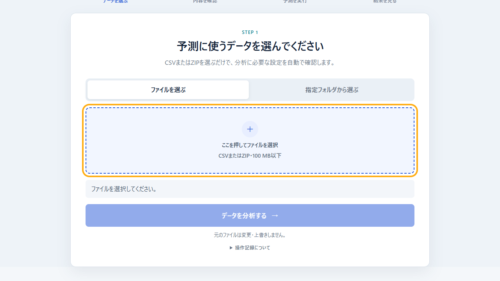
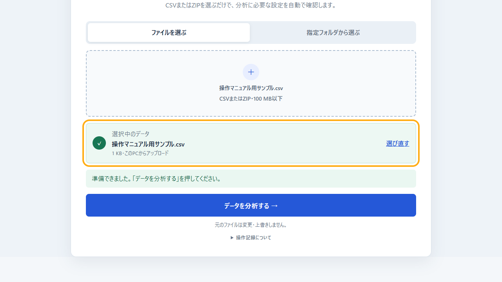
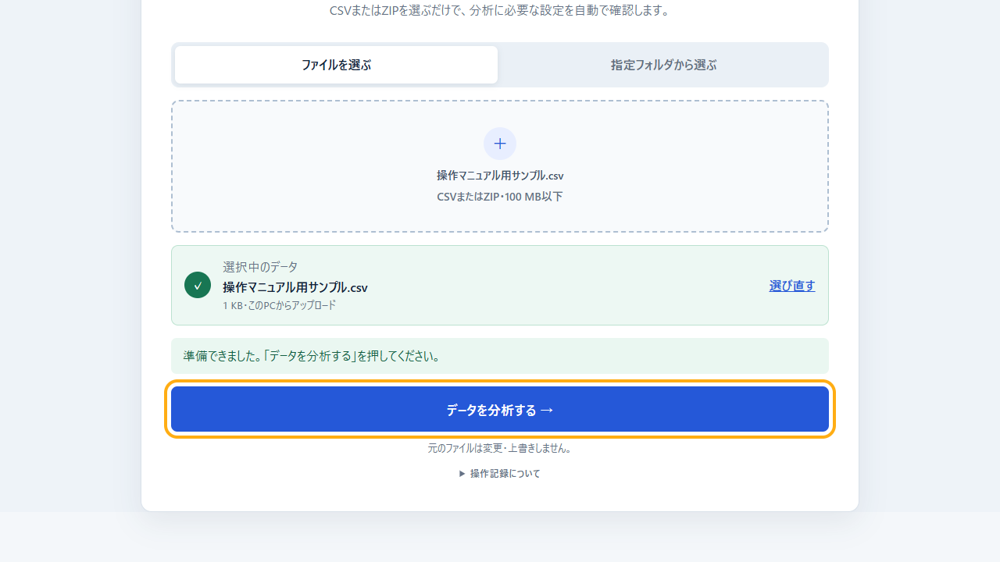
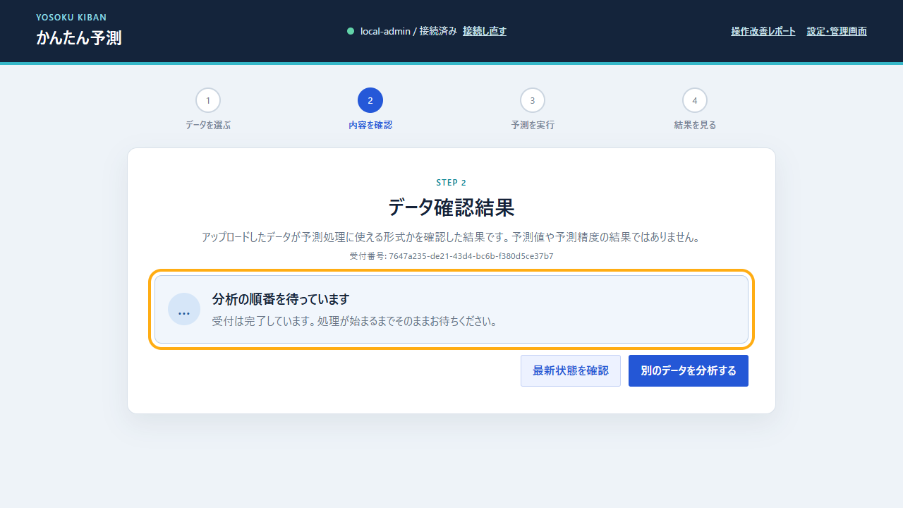
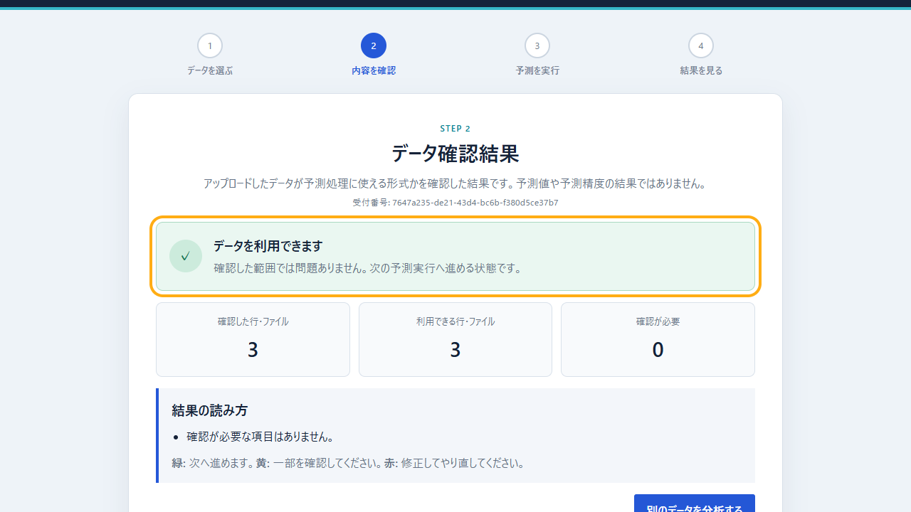
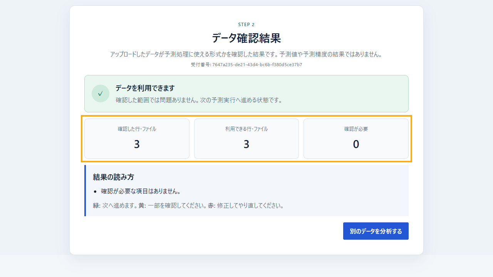
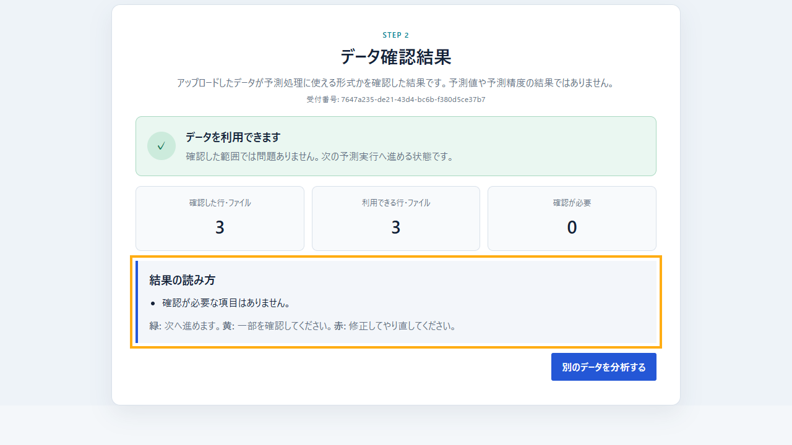

# 担当者向け操作マニュアル

起動後の「かんたん予測」画面で、CSVまたはZIPを選び、データ確認結果を読むまでの手順です。

## 動画

- [音声・字幕付き動画（約1分30秒）](manual/かんたん予測_操作マニュアル.mp4)
- [字幕のみの動画（約1分30秒）](manual/かんたん予測_操作マニュアル_字幕版.mp4)

動画は操作説明用の人工データを使用しています。本番データ、接続コード、担当者情報は含みません。

## 操作前の確認

- 管理担当者から「起動しました」と連絡を受けている
- 接続コードが手元にある
- アップロードするCSVまたはZIPが100 MB以下である
- 元ファイルを閉じておく

## 1. かんたん予測を開く

起動時に案内されたURLをブラウザーで開きます。「このPCを接続します」と表示されます。

## 2. 接続コードを入力する

接続コードを入力して「接続する」を押します。コードは画面を閉じると消去されます。

「接続コードを確認してください」と表示された場合は、入力したコードを確認します。解決しない場合は管理担当者へ連絡します。

## 3. ファイルを選ぶ

「ファイルを選ぶ」タブで「ここを押してファイルを選択」を押し、CSVまたはZIPを選びます。

会社の指定フォルダーを使用する場合は「指定フォルダから選ぶ」タブを開き、一覧から対象データを選びます。追加直後のファイルが表示されない場合は「一覧を更新」を押します。

## 4. 選択内容を確認する

「選択中のデータ」に表示されたファイル名と容量を確認します。違う場合は「選び直す」を押します。

## 5. 分析を開始する

「準備できました」と表示されたら「データを分析する」を押します。処理中は画面を閉じず、ボタンを繰り返し押さないでください。

## 6. 受付後は結果が出るまで待つ

受付番号と「結果を確認しています」が表示されます。画面は閉じず、同じボタンを繰り返し押さずに待ちます。受付番号は問い合わせ時に使用します。

## 7. 色と見出しで判定する

結果の最上部にある色と見出しを確認します。

- **緑「データを利用できます」**: 確認した範囲では問題がなく、次の予測実行へ進める状態です。
- **黄「一部のデータを確認してください」**: 利用できない行や確認事項があります。「結果の読み方」に表示された内容を確認します。
- **赤「データを修正してやり直してください」**: 必須列や形式などに問題があります。表示内容に沿って元データを修正し、再度分析します。

この画面は、アップロードしたデータが予測処理に使える形式かを確認した**データ確認結果**です。予測値や予測精度の結果ではありません。

## 8. 3つの件数を読む

中央の件数を左から順に確認します。

1. **確認した行・ファイル**: 今回検査した対象数です。
2. **利用できる行・ファイル**: 次の処理に利用できる対象数です。
3. **確認が必要**: 除外または修正の確認が必要な対象数です。

「利用できる件数」が「確認した件数」と同じで、「確認が必要」が0なら、確認した範囲はすべて利用できます。

## 9. 確認事項と次の操作を読む

「結果の読み方」に、確認または修正が必要な項目が表示されます。緑で確認事項がなければ、次の予測実行へ進めます。黄または赤の場合は、表示された内容を確認してから進みます。

別のファイルを試す場合は「別のデータを分析する」を押します。現時点では、この画面から実際の予測計算を開始する操作は次の実装対象です。

## エラーが表示された場合

次の情報を管理担当者へ伝えます。

1. エラーメッセージ
2. 操作した時刻
3. アップロードまたは指定フォルダーのどちらを使ったか
4. CSVまたはZIPのどちらを使ったか
5. 受付番号

商品名、数量、ファイル内容、接続コードはメールやチャットへ貼り付けません。元のファイルはこの操作で変更・上書きされません。
